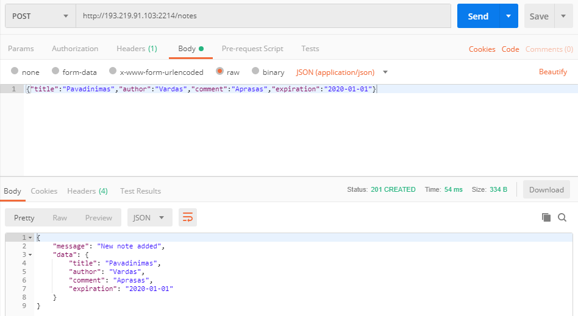

# Uzrasine

### Paleidimas ir stabdymas

Atsikopijuoti repozitorija:

- ```git clone https://github.com/plssts/SOA```

Is SOA/1 aplanko subuildinti ir paleisti:

- ```docker-compose up --build -d```

arba, jau subuildinus ir sustabdzius:

- ```docker start soa_web_1```

Po panaudojimo galima apvalyti \<none\>:\<none\> docker atvaizdus:
  
- ```docker rmi $(docker images --filter dangling=true -q --no-trunc)```

Stabdomas konteineris:

- ```docker stop soa_web_1```

### Naudojimas

GET /notes

- Grazina visus irasus.

GET /notes/[konktretaus iraso pavadinimas (title)]

- Grazina konkretu irasa.

POST /notes

- Sukuria nauja irasa, su tekstiniais argumentais:

  * 'title'       (iraso unikalus pavadinimas)
  * 'author'      (pasirasantis asmuo)
  * 'comment'     (papildoma informacija)
  * 'expiration'  (galiojimo data)
  
POST uzklausos pavyzdys per Postman:



PUT /notes/[konktretaus iraso pavadinimas (title)]

- Keicia esamo iraso laukus.

DELETE /notes/[konktretaus iraso pavadinimas (title)]

- Istrina irasa pagal pavadinima.
